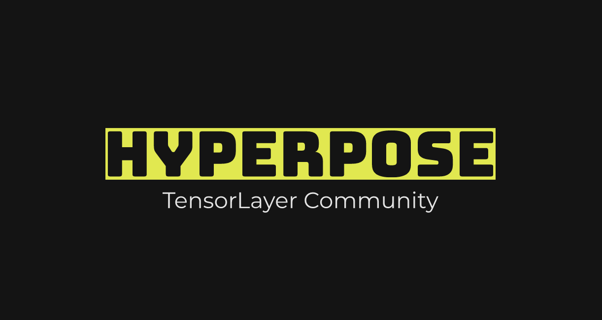

</a>

<p align="center">
    
</p>
<p align="center">
    <a href="https://readthedocs.org/projects/hyperpose/badge/?version=latest" title="Docs Building"></a>
    <a href="https://github.com/tensorlayer/hyperpose/actions?query=workflow%3ACI" title="Build Status"></a>
    <a href="https://hub.docker.com/r/tensorlayer/hyperpose" title="Docker"></a>
    <a href="https://github.com/tensorlayer/hyperpose/releases" title="Github Release"></a>
    <a href="https://drive.google.com/drive/folders/1w9EjMkrjxOmMw3Rf6fXXkiv_ge7M99jR?usp=sharing" title="PreTrainedModels"></a>
    <a href="https://en.cppreference.com/w/cpp/17" title="CppStandard"></a>
    <a href="https://github.com/tensorlayer/tensorlayer/blob/master/LICENSE.rst" title="TensorLayer">
</p>


---

<p align="center">
    <a href="#Features">Features</a> •
    <a href="#Documentation">Documentation</a> •
    <a href="#Quick-Start">Quick Start</a> •
    <a href="#Performance">Performance</a> •
    <a href="#Accuracy">Accuracy</a> •
    <a href="#Cite-Us">Cite Us</a> •
    <a href="#License">License</a>
</p>

# HyperPose

HyperPose is a library for building high-performance custom pose estimation applications.

## Features

HyperPose has two key features:

- **High-performance pose estimation with CPUs/GPUs**: HyperPose achieves real-time pose estimation through a high-performance pose estimation engine. This engine implements numerous system optimisations: pipeline parallelism, model inference with TensorRT, CPU/GPU hybrid scheduling, and many others. These optimisations contribute to up to 10x higher FPS compared to OpenPose, TF-Pose and OpenPifPaf.
- **Flexibility for developing custom pose estimation models**: HyperPose provides high-level Python APIs to develop pose estimation models. HyperPose users can:
    * Customise training, evaluation, visualisation, pre-processing and post-processing in pose estimation.
    * Customise model architectures (e.g., OpenPose, Pifpaf, PoseProposal Network) and training datasets.
    * Speed up training with multiple GPUs.

## Demo

</a>
<p align="center">
    
</p>

<p align="center">
    新宝岛 with HyperPose (Lightweight OpenPose model)
</p>

## Quick Start

The HyperPose library contains two parts:
* A C++ library for high-performance pose estimation model inference.
* A Python library for developing custom pose estimation models.

### C++ inference library

The easiest way to use the inference library is through a [Docker image](https://hub.docker.com/r/tensorlayer/hyperpose). Pre-requisites for this image:

- [CUDA Driver >= 418.81.07](https://www.tensorflow.org/install/gpu) (For default CUDA 10.0 image)
- [NVIDIA Docker >= 2.0](https://github.com/NVIDIA/nvidia-docker)
- [Docker CE Engine >= 19.03](https://docs.docker.com/engine/install/)

Run this command to check if pre-requisites are ready:

```bash
wget https://raw.githubusercontent.com/tensorlayer/hyperpose/master/scripts/test_docker.py -qO- | python
```

Once pre-requisites are ready, pull the HyperPose docker:

```bash
docker pull tensorlayer/hyperpose
```

We provide 4 examples within this image (The following commands have been tested on Ubuntu 18.04):

```bash
# [Example 1]: Doing inference on given video, copy the output.avi to the local path.
docker run --name quick-start --gpus all tensorlayer/hyperpose --runtime=stream
docker cp quick-start:/hyperpose/build/output.avi .
docker rm quick-start


# [Example 2](X11 server required to see the imshow window): Real-time inference.
# You may need to install X11 server locally:
# sudo apt install xorg openbox xauth
xhost +; docker run --rm --gpus all -e DISPLAY=$DISPLAY -v /tmp/.X11-unix:/tmp/.X11-unix tensorlayer/hyperpose --imshow


# [Example 3]: Camera + imshow window
xhost +; docker run --name pose-camera --rm --gpus all -e DISPLAY=$DISPLAY -v /tmp/.X11-unix:/tmp/.X11-unix --device=/dev/video0:/dev/video0 tensorlayer/hyperpose --source=camera --imshow
# To quit this image, please type `docker kill pose-camera` in another terminal.


# [Dive into the image]
xhost +; docker run --rm --gpus all -it -e DISPLAY=$DISPLAY -v /tmp/.X11-unix:/tmp/.X11-unix --device=/dev/video0:/dev/video0 --entrypoint /bin/bash tensorlayer/hyperpose
# For users that cannot access a camera or X11 server. You may also use:
# docker run --rm --gpus all -it --entrypoint /bin/bash tensorlayer/hyperpose
```

For more usage regarding the command line flags, please visit [here](https://hyperpose.readthedocs.io/en/latest/markdown/quick_start/prediction.html#table-of-flags-for-hyperpose-cli).

### Python training library

We recommend using the Python training library within an [Anaconda](https://www.anaconda.com/products/individual) environment. The below quick-start has been tested with these environments:

| OS           | NVIDIA Driver | CUDA Toolkit | GPU            |
| ------------ | ------------- | ------------ | -------------- |
| Ubuntu 18.04 | 410.79        | 10.0         | Tesla V100-DGX |
| Ubuntu 18.04 | 440.33.01     | 10.2         | Tesla V100-DGX |
| Ubuntu 18.04 | 430.64        | 10.1         | TITAN RTX      |
| Ubuntu 18.04 | 430.26        | 10.2         | TITAN XP       |
| Ubuntu 16.04 | 430.50        | 10.1         | RTX 2080Ti     |

Once Anaconda is installed, run below Bash commands to create a virtual environment:

```bash
# Create virtual environment (choose yes)
conda create -n hyperpose python=3.7
# Activate the virtual environment, start installation
conda activate hyperpose
# Install cudatoolkit and cudnn library using conda
conda install cudatoolkit=10.0.130
conda install cudnn=7.6.0
```

We then clone the repository and install the dependencies listed in [requirements.txt](https://github.com/tensorlayer/hyperpose/blob/master/requirements.txt):

```bash
git clone https://github.com/tensorlayer/hyperpose.git && cd hyperpose
pip install -r requirements.txt
```

We demonstrate how to train a custom pose estimation model with HyperPose. HyperPose APIs contain three key modules: *Config*, *Model* and *Dataset*, and their basic usages are shown below.

```python
from hyperpose import Config, Model, Dataset

# Set model name to distinguish models (necessary)
Config.set_model_name("MyLightweightOpenPose")

# Set model type, model backbone and dataset
Config.set_model_type(Config.MODEL.LightweightOpenpose)
Config.set_model_backbone(Config.BACKBONE.Vggtiny)
Config.set_dataset_type(Config.DATA.MSCOCO)

# Set single-node training or parallel-training
Config.set_train_type(Config.TRAIN.Single_train)

config = Config.get_config()
model = Model.get_model(config)
dataset = Dataset.get_dataset(config)

# Start the training process
Model.get_train(config)(model, dataset)
```

The full training program is listed [here](https://github.com/tensorlayer/hyperpose/blob/master/train.py). To evaluate the trained model, you can use the evaluation program [here](https://github.com/tensorlayer/hyperpose/blob/master/eval.py). More information about the training library can be found [here](https://hyperpose.readthedocs.io/en/latest/markdown/quick_start/training.html).


## Documentation

The APIs of the HyperPose training library and the inference library are described in the [Documentation](https://hyperpose.readthedocs.io/en/latest/).

## Performance

We compare the prediction performance of HyperPose with [OpenPose 1.6](https://github.com/CMU-Perceptual-Computing-Lab/openpose), [TF-Pose](https://github.com/ildoonet/tf-pose-estimation) and [OpenPifPaf 0.12](https://github.com/openpifpaf/openpifpaf). The test-bed has Ubuntu18.04, 1070Ti GPU, Intel i7 CPU (12 logic cores).

| HyperPose Configuration  | DNN Size | Input Size | HyperPose | Baseline |
| --------------- | ------------- | ------------------ | ------------------ | --------------------- |
| OpenPose (VGG)   | 209.3MB       | 656 x 368            | **27.32 FPS**           | 8 FPS (OpenPose)          |
| OpenPose (TinyVGG)  | 34.7 MB       | 384 x 256          | **124.925 FPS**         | N/A                   |
| OpenPose (MobileNet) | 17.9 MB       | 432 x 368          | **84.32 FPS**           | 8.5 FPS (TF-Pose)         |
| OpenPose (ResNet18)  | 45.0 MB       | 432 x 368          | **62.52 FPS**           | N/A                  |
| OpenPifPaf (ResNet50)  | 97.6 MB       | 432 x 368          | **44.16 FPS**           | 14.5 FPS (OpenPifPaf)    |

## Accuracy

We evaluate the accuracy of pose estimation models developed by HyperPose. The environment is Ubuntu16.04, with 4 V100-DGXs and 24 Intel Xeon CPU. The training procedure takes 1~2 weeks using 1 V100-DGX for each model. (If you don't want to train from scratch, you could use our pre-trained backbone models)

| HyperPose Configuration | DNN Size | Input Size | Evaluate Dataset | Accuracy-hyperpose (Iou=0.50:0.95) | Accuracy-original (Iou=0.50:0.95) |
| -------------------- | ---------- | ------------- | ---------------- | --------------------- | ----------------------- |
| OpenPose (VGG19)   | 199 MB | 432 x 368 | MSCOCO2014 (random 1160 images) | 57.0 map | 58.4 map  |
| LightweightOpenPose (Dilated MobileNet)   | 17.7 MB | 432 x 368 | MSCOCO2017(all 5000 img.) | 46.1 map | 42.8 map |
| LightweightOpenPose (MobileNet-Thin)   | 17.4 MB | 432 x 368 | MSCOCO2017 (all 5000 img.) | 44.2 map | 28.06 map (MSCOCO2014) |
| LightweightOpenPose (tiny VGG)   | 23.6 MB | 432 x 368 | MSCOCO2017 (all 5000 img.) | 47.3 map | - |
| LightweightOpenPose (ResNet50)   | 42.7 MB | 432 x 368 | MSCOCO2017 (all 5000 img.) | 48.2 map | - |
| PoseProposal (ResNet18)   | 45.2 MB | 384 x 384 | MPII (all 2729 img.) | 54.9 map (PCKh) | 72.8 map (PCKh)|

## Cite Us

If you find HyperPose helpful for your project, please cite our paper：

```
@article{hyperpose2021,
    author  = {Guo, Yixiao and Liu, Jiawei and Li, Guo and Mai, Luo and Dong, Hao},
    journal = {ACM Multimedia},
    title   = {{Fast and Flexible Human Pose Estimation with HyperPose}},
    url     = {https://github.com/tensorlayer/hyperpose},
    year    = {2021}
}
```

## License

HyperPose is open-sourced under the [Apache 2.0 license](https://github.com/tensorlayer/tensorlayer/blob/master/LICENSE.rst).

