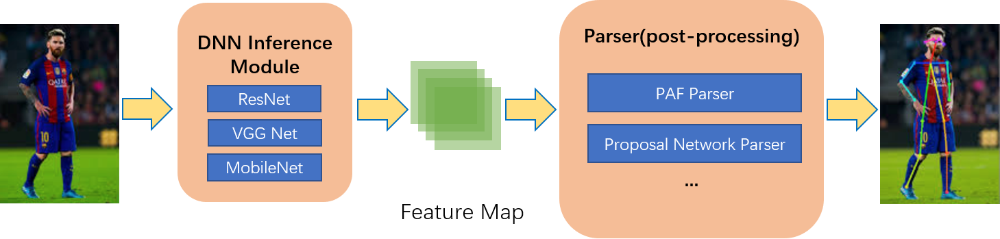
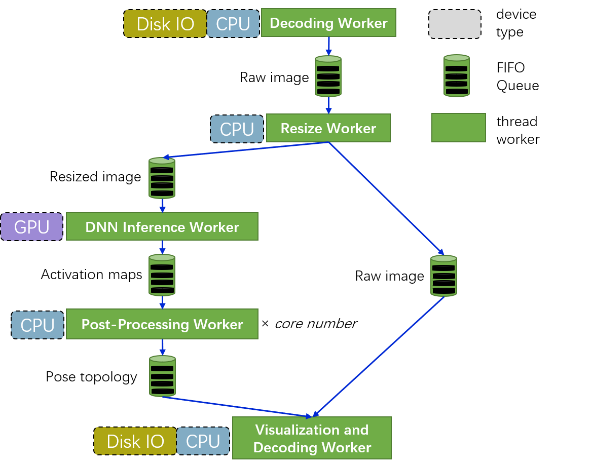

# Overview

## Why HyperPose

HyperPose provides:

- **Flexible training**
  - Well abstracted APIs(Python) to help you manage the pose estimation pipeline quickly and directly
  - Dataset(COCO, MPII)
  - Pose Estimation Methods
    - Backbones: ResNet, VGG(Tiny/Normal/Thin), Pose Proposal Network.
  - Post-Processing:  Part Association Field(PAF), Pose Proposal Networks.

- **Fast Prediction**
  - Rich operator APIs for you to do fast DNN inference and post-processing.
  - 2 API styles:
    - Operator API(Imperative): HyperPose provides basic operators to do DNN inference and post processing.
    - Stream API(Declarative): HyperPose provides a streaming processing runtime scheduler where users only need to specify the engine, post-processing methods and input/output streams.
  - Model format supports:
    - Uff.
    - ONNX.
    - Cuda Engine Protobuf.
  - Good performance. (see [here](../performance/prediction.md))

## Training Library Design

## Prediction Library Design

### HyperPose Prediction Pipeline

HyperPose supports prediction pipelines described in the image blow. (Mainly for bottom-up approaches)



### Operator API & Stream API

**Operator API** provides basic operators for users to manipulate the pipeline. And **Stream API** is based on **Operator API** and makes higher level scheduling on it.

#### Minimum Example For Operator API

To apply pose estimation to a video using **Operator API**:

```c++
#include <hyperpose/hyperpose.hpp>

int main() {
    using namespace hyperpose;

    const cv::Size network_resolution{384, 256};
    const dnn::uff uff_model{ "../data/models/TinyVGG-V1-HW=256x384.uff", "image", {"outputs/conf", "outputs/paf"} };

    // * Input video.
    auto capture = cv::VideoCapture("../data/media/video.avi");

    // * Output video.
    auto writer = cv::VideoWriter(
        "output.avi", capture.get(cv::CAP_PROP_FOURCC), capture.get(cv::CAP_PROP_FPS), network_resolution);

    // * Create TensorRT engine.
    dnn::tensorrt engine(uff_model, network_resolution);

    // * post-processing: Using paf.
    parser::paf parser{};

    while (capture.isOpened()) {
        std::vector<cv::Mat> batch;
        for (int i = 0; i < engine.max_batch_size(); ++i) {
            cv::Mat mat;
            capture >> mat;
            if (mat.empty())
                break;
            batch.push_back(mat);
        }

        if (batch.empty())
            break;

        // * TensorRT Inference.
        auto feature_map_packets = engine.inference(batch);

        // * Paf.
        std::vector<std::vector<human_t>> pose_vectors;
        pose_vectors.reserve(feature_map_packets.size());
        for (auto&& packet : feature_map_packets)
            pose_vectors.push_back(parser.process(packet[0], packet[1]));

        // * Visualization
        for (size_t i = 0; i < batch.size(); ++i) {
            cv::resize(batch[i], batch[i], network_resolution);
            for (auto&& pose : pose_vectors[i])
                draw_human(batch[i], pose);
            writer << batch[i];
        }
    }
}
```

#### Minimum Example For Stream API

To apply pose estimation to a video using **Stream API**:

```c++
#include <hyperpose/hyperpose.hpp>

int main() {
    using namespace hyperpose;

    const cv::Size network_resolution{384, 256};
    const dnn::uff uff_model{ "../data/models/TinyVGG-V1-HW=256x384.uff", "image", {"outputs/conf", "outputs/paf"} };

    // * Input video.
    auto capture = cv::VideoCapture("../data/media/video.avi");

    // * Output video.
    auto writer = cv::VideoWriter(
        "output.avi", capture.get(cv::CAP_PROP_FOURCC), capture.get(cv::CAP_PROP_FPS), network_resolution);

    // * Create TensorRT engine.
    dnn::tensorrt engine(uff_model, network_resolution);

    // * post-processing: Using paf.
    parser::paf parser{};

    // * Create stream
    auto stream = make_stream(engine, parser);

    // * Connect input stream.
    stream.async() << capture;

    // * Connect ouput stream and wait.
    stream.sync() >> writer;
}
```

Using the **Stream API**, it is much faster and with less codes!

#### Stream Processing in Stream API

- Every worker is a thread.
- Every worker communicates via a FIFO queue.
- The DNN inference worker will do greedy batching for the inputs.



